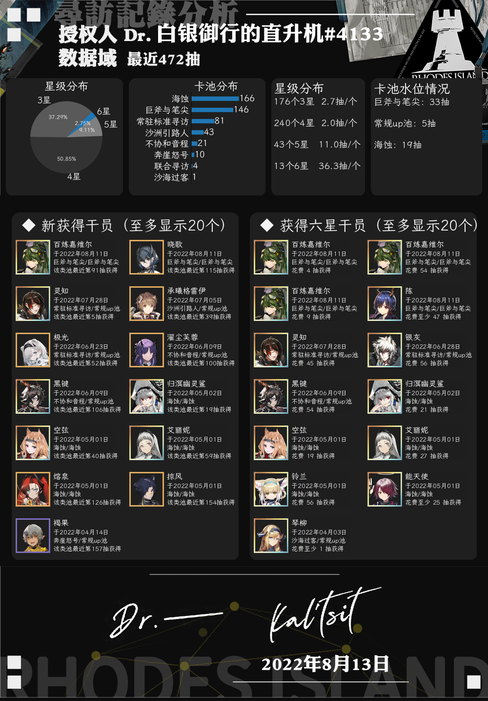

<h1 align="center"><b>nonebot_plugin_arkrecord</b></h1>
<p align="center">
    
    
    
</p>
<h2 align="center"><b>欢迎使用明日方舟抽卡分析NoneBot2插件!</b></h2>
<h4 align="center">本插件为基于python3.9开发的NoneBot2插件，NoneBot2适配器为OneBotV11
</h4>

## **丨插件部署说明**

如果你还没有安装NoneBot2，可以参考[NoneBot2官网](https://nb2.baka.icu/)配置NoneBot2后再安装本插件

本插件依赖于sqlite数据库，参考网络资源（如[菜鸟教程](https://www.runoob.com/sqlite/sqlite-installation.html)）安装SQLite数据库并设置环境变量（windows）后即可，无需配置数据库环境

如需修改数据库文件名称，可以修改 `ark/ark_setting.py` 中的 `arkgacha_db_path`项

输出时，如果没有可用干员头像，将以海猫头像代替


## **丨插件部署方法**

在命令行（cmd）中

``` shell
pip install nonebot_plugin_arkrecord
```

载入插件方式与载入其他插件方式相同，即在NoneBot2的`bot.py`中添加一行

```python
nonebot.load_plugin('nonebot_plugin_arkrecord')
```

## **丨插件使用方法**
### **token设置**

每个用户第一次使用时，需要设置token。

**token获取方法**：在官网登录后，根据你的服务器，选择复制以下网址中的内容
 
官服：https://as.hypergryph.com/user/info/v1/token_by_cookie

B服：https://web-api.hypergryph.com/account/info/ak-b

***请在浏览器中获取token，避免在QQ打开的网页中获取，否则可能获取无效token***

**token设置方法**：使用插件命令`方舟抽卡token 你的token`(自动识别B服、官服token)
或`方舟寻访token 你的token`进行设置

如网页中内容为
```json
{"status":0,"msg":"OK","data":{"token":"example123456789"}}
```
则使用命令 `方舟抽卡token example123456789`， 如果间隔超**3天**再次使用，建议重新使用上述方式设置token
### **寻访记录分析**

设置token后，直接使用`方舟抽卡分析`或`方舟寻访分析`即可

还可以使用`方舟抽卡分析 数字`，分析最近一定抽数的寻访情况

如`方舟抽卡分析 100`分析最近100抽的情况



### **更新卡池信息与干员头像**

使用`方舟卡池更新`命令，自动从PRTS更新卡池信息及干员头像文件

### **导出记录**

使用`方舟抽卡导出`命令，可以在群聊中导出你当前关联token的储存于插件数据库中的寻访记录。请注意，目前只支持在群聊中导出

### **获取帮助**
使用`方舟寻访帮助`或`方舟抽卡帮助`命令，可以获取插件帮助

### **其他功能**
使用`随机干员`命令，随机给出一张干员头像

## **丨未来更新计划**

- 暂无，欢迎提issue

## **丨参考**
作图代码参考于

- [nonebot-plugin-gachalogs](https://github.com/monsterxcn/nonebot-plugin-gachalogs)

- [nonebot_plugin_gamedraw](https://github.com/HibiKier/nonebot_plugin_gamedraw)

## **丨开发人员信息**
主体开发[本人](https://github.com/zheuziihau)

美术资源及需求设计 [@Alnas1](https://github.com/Alnas1)