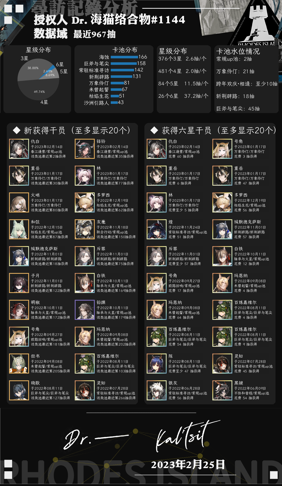

<h1 align="center"><b>nonebot_plugin_arkrecord</b></h1>
<p align="center">
    
    
    
</p>
<h2 align="center"><b>欢迎使用明日方舟抽卡分析NoneBot2插件!</b></h2>
<h4 align="center">本插件为基于python3.9开发的NoneBot2插件，NoneBot2适配器为OneBotV11，当前版本V1.6.2.2
</h4>

### **若对插件安装、使用有疑问，或在使用中遇到BUG，欢迎在issue区发问；或直接联系作者：QQ 812325695。我将尽可能地排查并解决问题**

## **丨插件部署说明**

1、如果你还没有安装NoneBot2，可以参考[NoneBot2官网](https://nb2.baka.icu/)配置NoneBot2后再安装本插件

2、本插件依赖于sqlite数据库，请参考网络资源（如[菜鸟教程](https://www.runoob.com/sqlite/sqlite-installation.html)）安装SQLite数据库，无需控制数据库用户、创建数据库表等操作。
但若为Windows环境，还需设置环境变量，无需配置数据库环境

3、运行本插件前，需要在机器人的.env.prod文件中配置数据库储存路径，如
```arkrecord_db_path = "/root/.arkrecord"```

如果你是1.7版本之前就在使用本插件的老用户，可以直接该路径为```arkrecord_db_path = "/root/.arkrecord"```以保证与此前版本保持一致

4、输出时，如果没有可用干员头像，将以海猫头像代替

**<h2><font color='red'> 丨特别说明 </font></h2>**

如遇报错“token保存”失败，请检查你的数据库是否为空（**大小为0kb**）。目前已经出现多例由于数据库由于变空，导致的“token保存失败”错误。

已经查明，数据库变空是在**数据库被从```./resource/```复制到```数据库存放位置```的过程中**发生的。可能是```shutil.copy()```的问题，具体触发原因及触发条件未知。

如果你遭遇此问题，请尝试以下两种解决方法
- 删除数据库文件存放路径中的```arkgacha_record16.db```，然后重启启动nonebot机器人
- 如果依然无法运行，请下载本github仓库中的```./nonebot_plugin_arkrecord/resource/arkgacha_record16.db```，数据库存放路径下的数据库进行替换

数据库文件存放位置：

```C://USERS/{USER_NAME}/.arkrecord``` (Windows)

或

```/root/.arkrecord``` (Linux)

v1.6.3版本 已经将复制命令由```shutil.copy()```更换为系统命令，但仍无法完全保证此现象未来不会重现。如出现无法解决的问题请联系开发者处理解决。

## **丨插件部署方法**

在命令行（cmd）中

``` shell
pip install nonebot_plugin_arkrecord
```

载入插件方式与载入其他插件方式相同，即在NoneBot2的`bot.py`中添加一行

```python
nonebot.load_plugin('nonebot_plugin_arkrecord')
```

**如果你在linux下部署，且部署用户不为```root```，需要更改```./nonebot_plugin_arkrecord/ark/ark_setting.py```中第十行的变量```linux_user_name```为你的部署用户名**

## **丨插件使用方法**
### **步骤1：token设置**

每个用户第一次使用时，需要设置token。

**1.1 token获取方法**：在官网登录后，根据你的服务器，选择复制以下网址中的内容
 
官服：https://web-api.hypergryph.com/account/info/hg

B服：https://web-api.hypergryph.com/account/info/ak-b


**1.2 token设置方法**：使用插件命令`方舟抽卡token 页面内容`(自动识别B服、官服token)
或`方舟寻访token 页面内容`进行设置

如网页中内容为
```json
{"status":0,"msg":"OK","data":{"token":"example123456789"}}
```
则使用命令 `方舟抽卡token {"status":0,"msg":"OK","data":{"token":"example123456789"}}`， 如果间隔超**3天**再次使用，建议重新使用上述方式设置token
### **步骤2：寻访记录分析**

设置token后，直接使用`方舟抽卡分析`或`方舟寻访分析`即可

还可以使用`方舟抽卡分析 数字`，分析最近一定抽数的寻访情况

如`方舟抽卡分析 100`分析最近100抽的情况



### **插件维护：更新卡池信息与干员头像**
**全局更新**

使用`方舟卡池更新`命令，自动从PRTS更新卡池信息及干员头像文件

**手动添加卡池**

在卡池开放后，往往需要在数个小时才能从PRTS上获取正确的卡池名称与内容。此时若希望使用本插件，可以使用手动添加卡池功能，命令格式为

```手动添加卡池|卡池名称|限定类型（限定 非限定）|添加者QQ号```

如

```手动添加卡池|万象伶仃|限定|4008208820```

### **导出记录**

使用`方舟抽卡导出`命令，可以在群聊中导出你当前关联token的储存于插件数据库中的寻访记录。请注意，目前只支持在群聊中导出

### **获取帮助**
使用`方舟寻访帮助`或`方舟抽卡帮助`命令，可以获取插件帮助

### **其他功能**
使用`随机干员`命令，随机给出一张干员头像

## **丨更新日志**
- v1.6.0 - v1.6.3 更新内容已隐去，详情请查看既往版本的md文件
- v1.6.4 修复了由于sqlite版本差异导致的抽卡记录可能无法保存的问题，感谢@
- v1.6.4 调整了命令优先级，出现命令无法响应的概率降低了
- v1.7.0 调整了关键参数配置方式
- v1.7.0 **调整了token输入方式，现在可以输入整个token网页内容以设置token**
- v1.7.0 新增了日志系统，现在可以在arkrecord_db_path文件夹下获取运行报错日志
- v1.7.0 **新增了手动卡池更新命令，再也不用为更新后无法及时获取寻访分析发愁了！（也许）**
- v1.7.0 优化了数据库读写的逻辑

## **| 更新计划**
- 敬请期待win-exe版方舟抽卡分析小工具
## **| 参考**
作图代码参考于

- [nonebot-plugin-gachalogs](https://github.com/monsterxcn/nonebot-plugin-gachalogs)

- [nonebot_plugin_gamedraw](https://github.com/HibiKier/nonebot_plugin_gamedraw)

## **| 开发人员信息**
主体开发[本人](https://github.com/zheuziihau)

美术资源及需求设计 [@Alnas1](https://github.com/Alnas1)